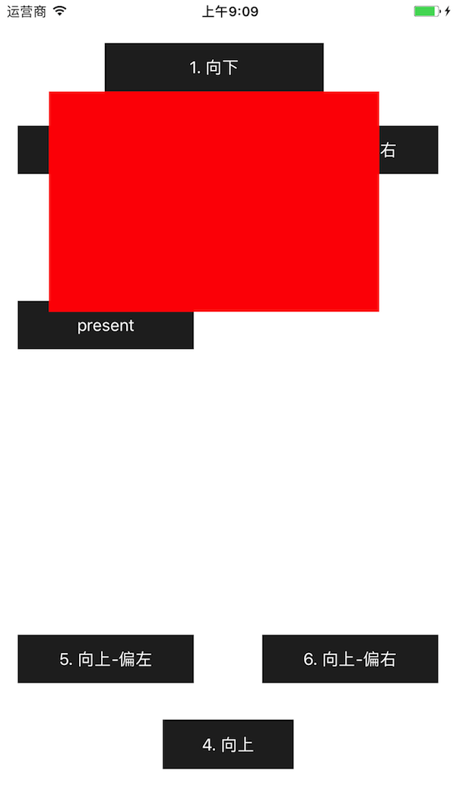

# ZZPopWindow
无箭头下、上、左、右弹框

示例图：



**使用方法**

1. 把文件夹ZZPopWindow托入工程 （含类ZZPopWindow,  ZZPositionList）

2. `import "ZZPopWindow.h"`

3. ```objective-c
   - (IBAction)show:(UIButton *)button {
       UIView *contentView = ...
       self.popWindow = [[ZZPopWindow alloc] init];
       self.popWindow.contentView = contentView;
       self.popWindow.popPosition = ZZPopPositionDown;
       [self.popWindow showAtView:button];
   }
   ```

   ​

